# KSE-100 Equity Price Forecasting

A decoupled Signal + Risk engine for 30-day KSE-100 return forecasting using Mamba, TimeGPT, SARIMAX, and GARCH.

 

---

## Table of Contents

1. [Overview](#overview)
2. [Data & Features](#data--features)
3. [Data Properties](#data-properties)
4. [Data Cleaning & Transformations](#data-cleaning--transformations)
5. [Model Architecture](#model-architecture)
6. [Evaluation Metrics](#evaluation-metrics)
7. [Results](#results)
8. [Trading Strategy & Implementation](#trading-strategy--implementation)
9. [Repository Structure](#repository-structure)
10. [Setup & Usage](#setup--usage)
11. [Future Work](#future-work)
---

## Overview

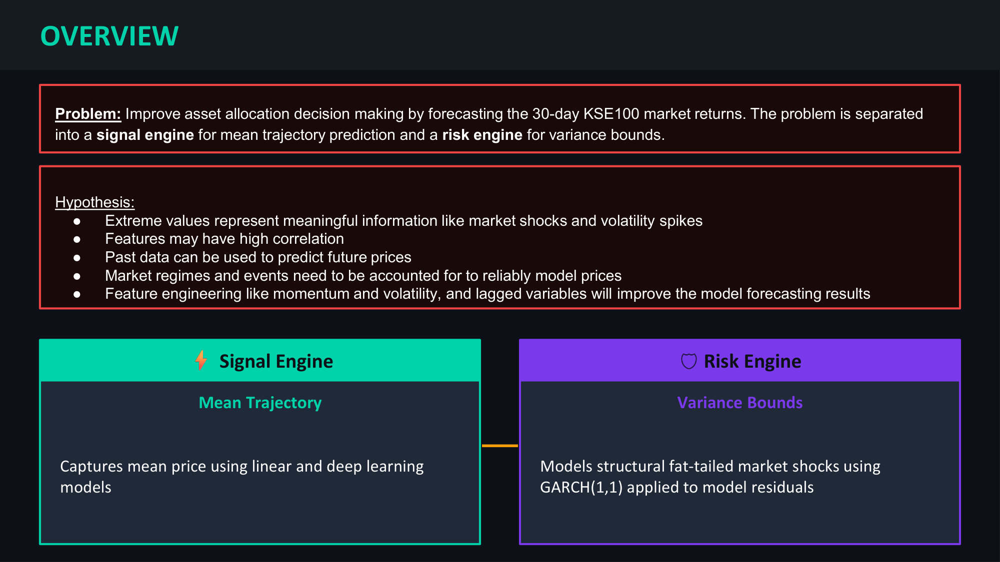

---

## Data & Features

| Detail | Value |
|--------|-------|
| Index | KSE-100 (Karachi Stock Exchange 100) |
| Period | 2016 – 2026 |
| Records | 2,514 trading days |
| Target | Log-Return: yₜ = ln(Pₜ / Pₜ₋₁) |

### Feature Groups

**Auto-Regressive Returns**
- Log return, 1 / 2 / 3 / 5 / 10-day lagged returns

**Momentum & Oscillators**
- RSI-14 overbought indicator, RSI-14 oversold indicator
- MACD Histogram

**Volatility & Drawdown**
- True Range
- Days since highest close (63-day window)
- Days since highest close (252-day window)

**Interest Rate Dynamics**
- 5-day change in KIBOR (Karachi Interbank Offered Rate)
- 20-day change in KIBOR

**Cross-Market & Macro**
- S&P 500 log return
- Emerging Markets ETF log return
- Vanguard FTSE Developed Market ETF log return
- Change in VIX volatility index
- USD/PKR log return
- Annual GDP Growth Rate

**Event & Holidays**
- Post-holiday indicator
- IMF event indicator
- 3-day IMF event window indicator

---

## Data Properties

### Non-Stationarity

Raw prices trend upward and fail stationarity tests. Log-returns oscillate around zero and pass the ADF test, making them the appropriate model target. This transformation eliminates data leakage and forces the model to predict actual daily magnitude and direction.

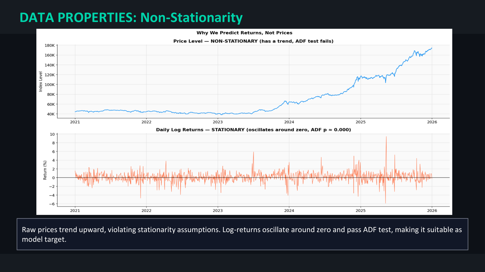

### Volatility Clustering

Turbulent periods cluster together and persist for weeks. GARCH(1,1) exploits this structure to model dynamic risk bounds.

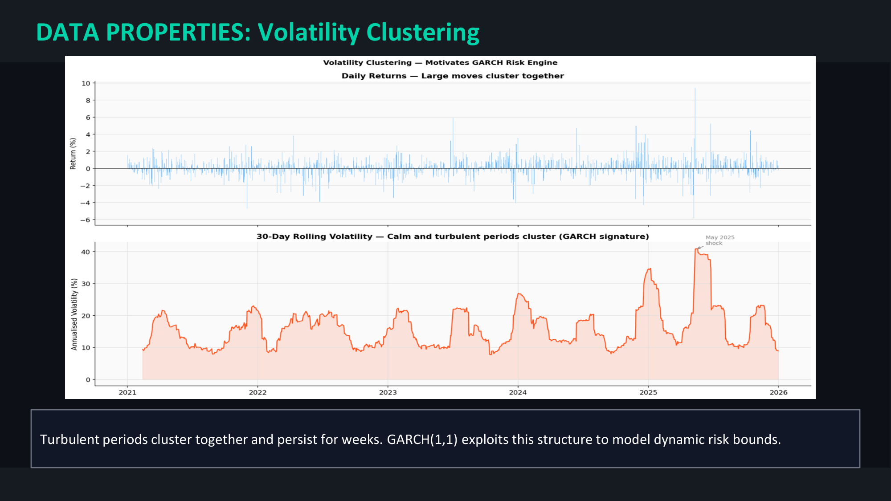

### Fat Tails

Excess kurtosis = **7.65** (vs. 0 for a normal distribution). Severe shocks occur far more frequently than Gaussian models predict — this motivates the Student-T GARCH rather than a standard normal GARCH.

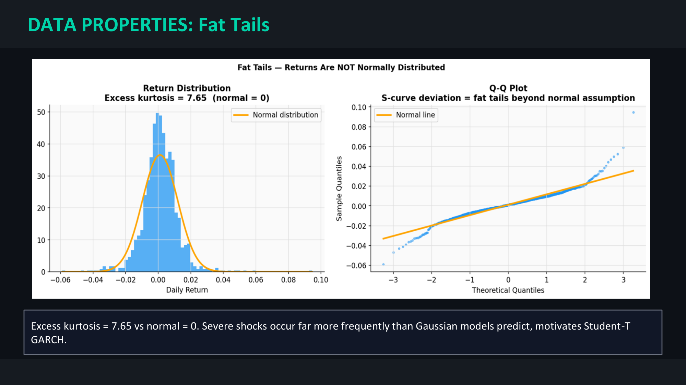

---

## Data Cleaning & Transformations

- **Anomaly detection:** Anomalous readings retained — extreme values reflect real market shocks, not data errors
- **Missing data:** Missing rows dropped
- **Multicollinearity control:** VIF (Variance Inflation Factor) test used to remove highly collinear features
- **Correlation filtering:** High-correlation pair filtering to remove redundant features
- **Key transformation:** Log-return sequence — yₜ = ln(Pₜ / Pₜ₋₁)
- **Evaluation protocol:** In-sample training → strict out-of-sample 30-day evaluation with no data leakage across the partition boundary

---

## Model Architecture

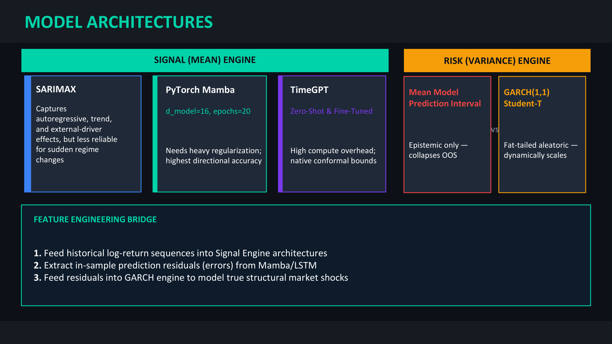

### Signal Engine (Mean Trajectory)

| Model | Description |
|-------|-------------|
| **SARIMAX** | Captures autoregressive, trend, and external-driver effects; less reliable for sudden regime changes |
| **PyTorch Mamba** | Selective SSM, d_model=16, epochs=20; needs heavy regularization; highest directional accuracy |
| **TimeGPT Zero-Shot** | Nixtla foundation model; no fine-tuning; native conformal bounds |
| **TimeGPT Fine-Tuned** | 20 fine-tuning steps on KSE-100 history; high compute overhead |

### Risk Engine (Variance Bounds)

Two approaches compared:

| Approach | Behaviour |
|----------|-----------|
| MC Dropout (epistemic only) | Intervals collapse out-of-sample — not reliable for aleatoric risk |
| **GARCH(1,1) Student-T** | Fat-tailed aleatoric model that dynamically scales — the chosen approach |

### Feature Engineering Bridge

How the two engines connect:

1. Feed historical log-return sequences into the Signal Engine architectures
2. Extract in-sample prediction residuals (errors) from the Signal Engine
3. Feed residuals into GARCH to model true structural market shocks
4. Compute hybrid prediction interval: Mean ± 1.645 × √(GARCH variance)

---

## Evaluation Metrics

| Metric | Purpose |
|--------|---------|
| MAPE % | Scale-independent point forecast accuracy |
| SMAPE % | Symmetric variant of MAPE |
| MAE | Mean absolute error in index points |
| RMSE | Penalizes large errors |
| Directional Accuracy | % of correct up/down calls |
| Coverage Ratio | % of actuals falling within the 90% interval |
| MPIW | Mean Prediction Interval Width — sharpness of uncertainty bands |
| Winkler Score | Proper scoring rule for interval forecasts |

---

## Results

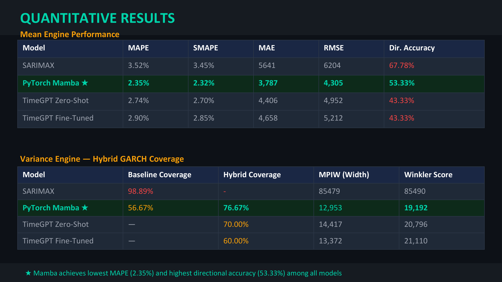

> **Note on SARIMAX:** Baseline coverage of 98.89% is too wide to be actionable.

> **Note on TimeGPT:** Zero-Shot outperforms Fine-Tuned on coverage (70% vs. 60%) — native conformal bounds are robust without an additional GARCH overlay.

### Forecast Plots

**SARIMAX — Mean Prediction + Hybrid GARCH Interval**

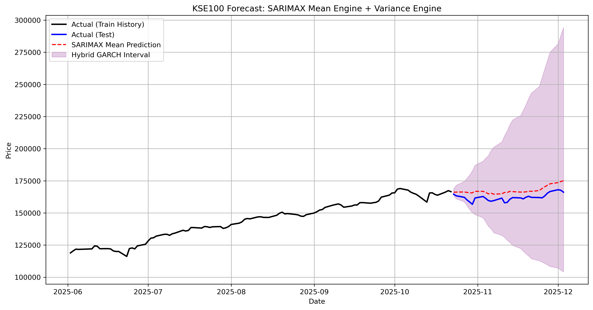

**XGBoost — Mean Prediction + Hybrid GARCH Interval**

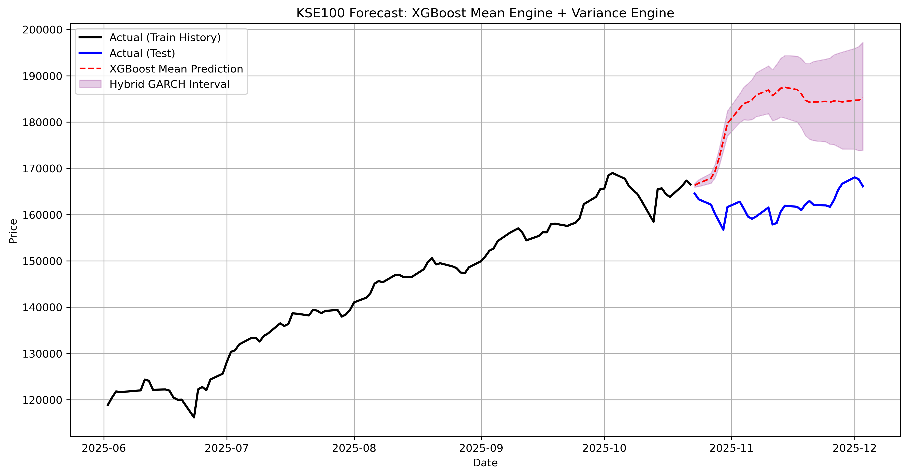

**PyTorch Mamba — 100-Day Context / 30-Day Zoom / Conditional Volatility**

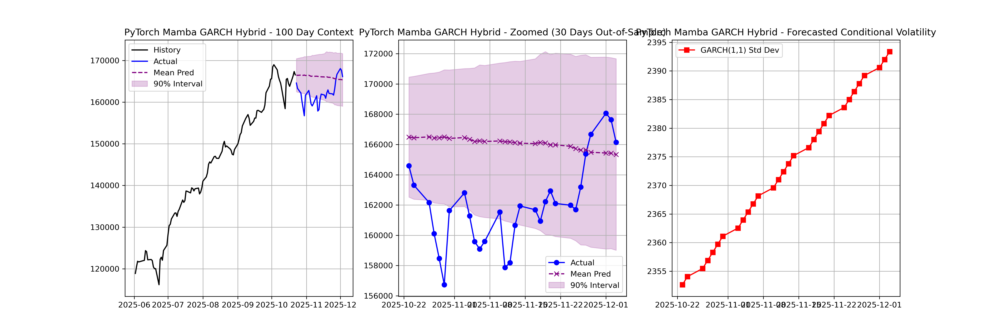

**TimeGPT Zero-Shot — 100-Day Context + 30-Day Zoom**

_GARCH_Hybrid.png)

**TimeGPT Fine-Tuned — 100-Day Context + 30-Day Zoom**

_GARCH_Hybrid.png)

---

## Trading Strategy & Implementation

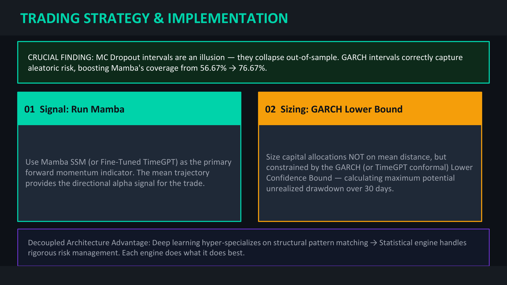

---

## Repository Structure

```
Pakistan_Stock_Market_Prediction/
├── data/                            # All datasets (raw → processed)
│   ├── Data_ Ref/                   # Raw reference data
│   ├── raw_data.csv
│   ├── Cleaned_Karachi_100_Data.csv
│   ├── filtered_feature_df.csv      # Final modelling dataset
│   └── ...
├── notebooks/                       # Jupyter notebooks (run in order)
│   ├── Cleaning_&_EDA.ipynb         # Step 1: Data cleaning & EDA
│   ├── KSE100_techinical_feature_engineering.ipynb  # Step 2: Technical indicators
│   └── Data Cleaning-Feature Engineering-SARIMAX.ipynb  # Step 3: SARIMAX, XGBoost, LSTM
├── models/                          # Python model scripts
│   ├── mamba_prediction.py          # Step 4: PyTorch Mamba Signal Engine
│   ├── timegpt_prediction.py        # Step 5: TimeGPT (zero-shot & fine-tuned)
│   └── variance_engine.py           # Step 6: Hybrid GARCH Risk Engine
├── results/                         # All forecast output plots
│   ├── sarimax_forecast_plot.png
│   ├── xgboost_forecast_plot.png
│   ├── PyTorch_Mamba_GARCH_Hybrid_GARCH_Hybrid.png
│   ├── TimeGPT_(Zero-Shot)_GARCH_Hybrid.png
│   └── TimeGPT_(Fine-Tuned)_GARCH_Hybrid.png
├── screenshots/                     # Presentation slides (used by README)
├── docs/                            # Project presentation
│   └── KSE100_Forecasting.pptx
├── Archive/                         # Superseded data versions
├── requirements.txt
├── LICENSE
└── .gitignore
```

---

## Setup & Usage

**Install dependencies:**

```bash
pip install -r requirements.txt
```

**Set the Nixtla API key (required for TimeGPT):**

```bash
# Linux / macOS
export NIXTLA_API_KEY=your_key_here

# Windows
set NIXTLA_API_KEY=your_key_here
```

**Run in order:**

| Step | File | Description |
|------|------|-------------|
| 1 | `notebooks/Cleaning_&_EDA.ipynb` | Data cleaning, stationarity tests, EDA |
| 2 | `notebooks/KSE100_techinical_feature_engineering.ipynb` | Build technical indicators |
| 3 | `notebooks/Data Cleaning-Feature Engineering-SARIMAX.ipynb` | SARIMAX, XGBoost, LSTM models |
| 4 | `python models/mamba_prediction.py` | PyTorch Mamba Signal Engine |
| 5 | `python models/timegpt_prediction.py` | TimeGPT zero-shot and fine-tuned *(requires API key)* |
| 6 | `python models/variance_engine.py` | Hybrid GARCH Risk Engine over all models |

---

## Future Work

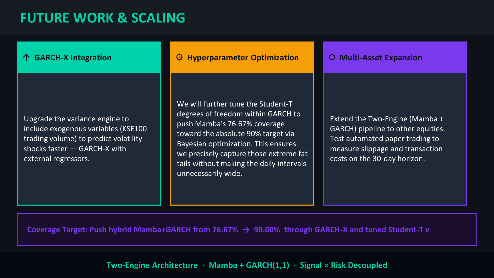

- **GARCH-X integration:** Upgrade the variance engine to include exogenous variables (KSE-100 trading volume) to predict volatility shocks faster — GARCH-X with external regressors
- **Hyperparameter optimization:** Tune the Student-T degrees of freedom within GARCH via Bayesian optimization to push Mamba's hybrid coverage from 76.67% → 90%, capturing extreme fat tails without unnecessarily wide daily intervals
- **Multi-asset expansion:** Extend the two-engine pipeline to other equities; test automated paper trading to measure slippage and transaction costs on the 30-day horizon

**Coverage target:** Push hybrid Mamba + GARCH from 76.67% → 90.00% through GARCH-X and tuned Student-T ν.

---

*Licensed under the [MIT License](LICENSE).*
